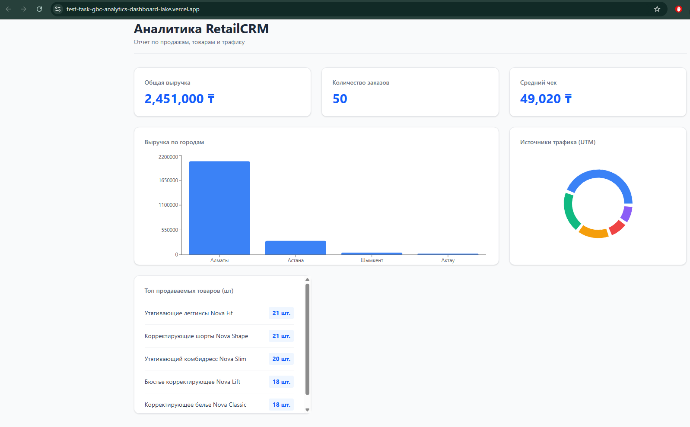
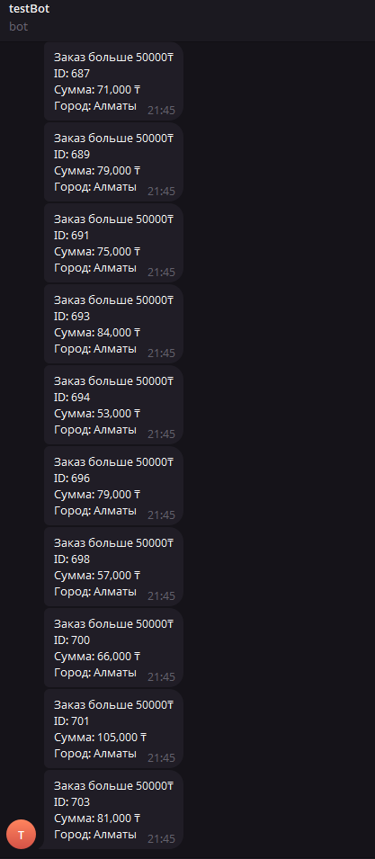
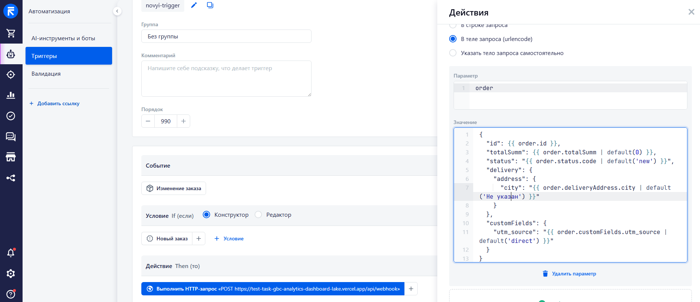

# Тестовое задание — AI Tools Specialist

Построй мини-дашборд заказов. Используй Claude Code CLI (или другой AI-инструмент).

## Что нужно сделать

### Шаг 1: Создай аккаунты (всё бесплатно)

- [RetailCRM](https://www.retailcrm.ru/) — демо-аккаунт
- [Supabase](https://supabase.com/) — бесплатный проект
- [Vercel](https://vercel.com/) — бесплатный аккаунт
- [Telegram Bot](https://t.me/BotFather) — создай бота

### Шаг 2: Загрузи заказы в RetailCRM

В репо есть `mock_orders.json` — 50 тестовых заказов. Загрузи их в свой RetailCRM через API.

### Шаг 3: RetailCRM → Supabase

Напиши скрипт который забирает заказы из RetailCRM API и кладёт в Supabase.

### Шаг 4: Дашборд

Сделай веб-страницу с графиком заказов (данные из Supabase). Задеплой на Vercel.

### Шаг 5: Telegram-бот

Настрой уведомление в Telegram когда в RetailCRM появляется заказ на сумму больше 50,000 ₸.

## Результат

- Ссылка на работающий дашборд (Vercel)
- Ссылка на GitHub-репо с кодом
- Скриншот уведомления из Telegram
- В README репо опиши: какие промпты давал Claude Code, где застрял, как решил

## Как сдать

Отправь результат в Telegram: @DmitriyKrasnikov

# Описание проекта
Интерактивный дашборд для аналитики заказов из RetailCRM. Проект перехватывает вебхуки о новых заказах, сохраняет их в базу данных, отправляет уведомления в Telegram о крупных чеках и отображает статистику в реальном времени.

## Ссылки
- **Vercel:** [https://test-task-gbc-analytics-dashboard-lake.vercel.app/]
- **Тестовые данные:** `mock_orders.json` (50 заказов)

 

---

## Как это работает (Data Flow)

1. Скрипт `upload_to_crm.py` загружает 50 моковых заказов в RetailCRM через API.
2. В RetailCRM срабатывает настроенный триггер на создание заказа.
3. Триггер отправляет POST-запрос на эндпоинт `/api/webhook` в Vercel.
4. FastAPI валидирует данные через Pydantic, сохраняет (Upsert) их в **Supabase** и проверяет сумму.
5. Если сумма заказа > 50 000 ₸, асинхронно отправляется сообщение через **Telegram Bot API**.
6. Frontend раз в 5 секунд запрашивает агрегированные данные из Supabase и обновляет дашборд.

**Скриншот уведомлений в телеграм:**

 

---

## Настройка и запуск проекта

### 1. Переменные окружения (.env)
Создайте файл `.env` в корне проекта:
```env
RETAILCRM_URL=https://ваша-crm.retailcrm.ru
RETAILCRM_API_KEY=ваш_ключ
SUPABASE_URL=https://ваш-проект.supabase.co
SUPABASE_KEY=ваш_anon_key
TELEGRAM_BOT_TOKEN=токен_бота_от_BotFather
TELEGRAM_CHAT_ID=ваш_chat_id
```
### 2. Настройка базы данных supabase

В Supabase в разделе SQL Editor выполните следующий код для создания таблицы:

```sql
CREATE TABLE orders (
    id UUID DEFAULT uuid_generate_v4() PRIMARY KEY,
    crm_id BIGINT UNIQUE NOT NULL,
    total_sum NUMERIC,
    city VARCHAR(255),
    utm_source VARCHAR(255),
    status VARCHAR(50),
    created_at TIMESTAMP WITH TIME ZONE DEFAULT NOW(),
    raw_data JSONB
);

ALTER TABLE orders DISABLE ROW LEVEL SECURITY;
```

Для создания и RPC-функции агрегации:

```sql
CREATE OR REPLACE FUNCTION get_dashboard_metrics()
RETURNS json AS $$
DECLARE
    result json;
BEGIN
    SELECT json_build_object(
        'total_revenue', COALESCE((SELECT SUM(total_sum) FROM orders), 0),
        'orders_count', (SELECT COUNT(*) FROM orders),
        'avg_check', COALESCE((SELECT AVG(total_sum) FROM orders), 0),
        
        'city_data', (
            SELECT COALESCE(json_agg(json_build_object('name', COALESCE(city, 'Не указан'), 'value', val)), '[]'::json)
            FROM (SELECT city, SUM(total_sum) as val FROM orders GROUP BY city ORDER BY val DESC) c
        ),
        
        'utm_data', (
            SELECT COALESCE(json_agg(json_build_object('name', COALESCE(utm_source, 'direct'), 'value', val)), '[]'::json)
            FROM (SELECT utm_source, SUM(total_sum) as val FROM orders GROUP BY utm_source ORDER BY val DESC) u
        ),
        
        'top_products', (
            SELECT COALESCE(json_agg(json_build_object('name', p_name, 'value', qty)), '[]'::json)
            FROM (
                SELECT 
                    COALESCE(item->'offer'->>'name', item->>'productName', 'Неизвестно') as p_name,
                    SUM(CAST(item->>'quantity' AS numeric)) as qty
                FROM orders,
                jsonb_array_elements(
                    CASE 
                        WHEN jsonb_typeof(raw_data->'items') = 'array' THEN raw_data->'items' 
                        ELSE '[]'::jsonb 
                    END
                ) as item
                GROUP BY p_name
                ORDER BY qty DESC
                LIMIT 5
            ) p
        )
    ) INTO result;
    RETURN result;
END;
$$ LANGUAGE plpgsql;
```

### 3. Настройка Триггера в RetailCRM

Чтобы CRM моментально отправляла вебхук при создании заказа, необходимо настроить триггер

Изменение заказа -> новый заказ -> HTTP-запрос на проектв vercel

 

## Трудности

### 1. Специфика Serverless Vercel
В Vercel фоновые задачи из FastAPI замораживаются сразу после отправки HTTP-ответа, из-за чего данные не доходили до БД. Нужно было перейти на `await` вместо `BachroundTask`, как изначально планировалось.

### 2. Настройка триггеров RetailCRM
Поиск вебхука привёл к триггерам автоматизации.
Стандартная функция `{{ order | json_encode }}` в RetailCRM возвращала пустой объект `{}` из-за глубокой вложенности внутренних данных. Нуэно было собирать как на скриншоте.

### 3. Автоматическое обновление графиков
Чтобы дашборд показывал новые заказы в реальном времени без ручной перезагрузки страницы, на фронтенде  был реализован автоматический опрос эндпоинта базы данных каждые 5 секунд через `setInterval`.